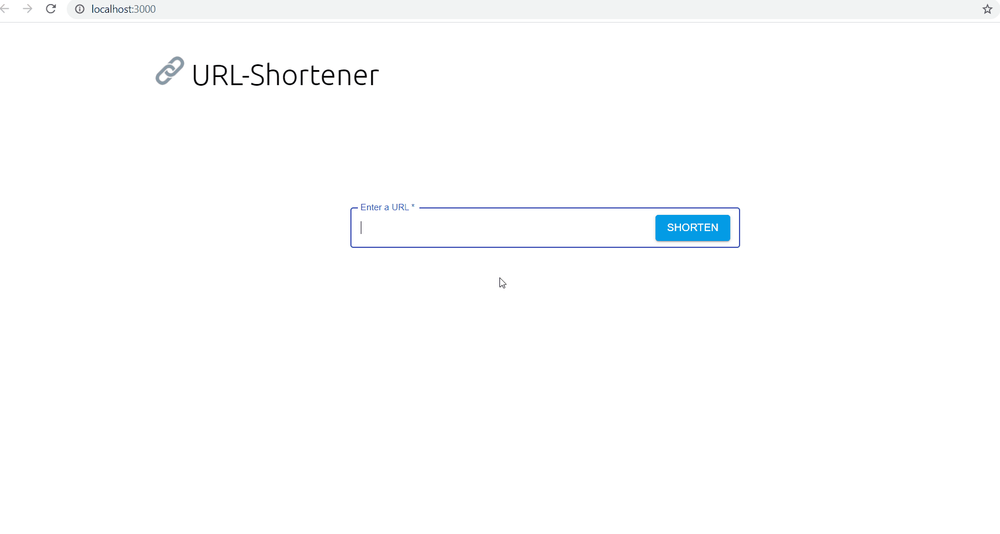

# 🔗 URL-Shortener

  
URL/Link shortener built on MERN stack.
  
    
   
    

  
---
  
### Tech Stack 📚

- A complete MERN stack project.

     
     
     
     
      
     
     
     
     

  
---  
  
 

### Demo 🎥

 

<h2 align="center">Setup 🛠</h2>  
  
### Prerequisites :  
  
- Make sure you have the LTS version of [Node](https://nodejs.org/) installed.
- Install [git](https://git-scm.com/downloads) for version control.
- Install [MongoDB](https://www.mongodb.com/try/download/community) locally. ([Resource](https://www.mongodb.com/docs/manual/administration/install-community/))

### Installation :

- Step 1: Fork [this repo](https://github.com/SandeepKrSuman/url-shortener).
- Step 2: Clone your forked version of this repo locally. To clone, go to your command line / terminal, cd over to an appropriate directory and type in `git clone https://github.com/<your username>/url-shortener.git`.
- Step 3: `cd url-shortener`
- Step 4: While in the `url-shortener` directory, install the frontend dependencies using `npm install` or `yarn`.
- Step 5: `cd server`
- Step 6: While in the `server` directory, instlal the backend dependencies using `npm install`.
- Step 7: Run the mongodb server on port: `27017` using `mongod`.
- Step 8: While mongod is still running, open a new tab and again `cd` inside the `server` directory and run the backend server using `node server.js` or using [nodemon](https://www.npmjs.com/package/nodemon) - `nodemon server.js`. The backend server will start on `localhost:5000`.
- Step 9: While backend server is still running, open a new tab on the terminal and `cd` to the main project directory i.e. `url-shortener`.
- Step 10: Finally start the react app using `npm start`. The app will start on port `3000` which can be accessed through <http://localhost:3000/>.

#### Note :

- Don't forget to close all the running servers before closing the terminal/ command line.
- Close all the running servers by visiting to every tab of the terminal the server is running on.
- To close a running server use `ctrl+c`.

---

   

If you like this project do show some love by giving this repo a 🌟.

  
 

### License

[MIT](LICENSE) © [SandeepKrSuman](https://github.com/SandeepKrSuman)

 

### Developer 😎

Made with ❤ by [SandeepKrSuman](https://github.com/SandeepKrSuman).
